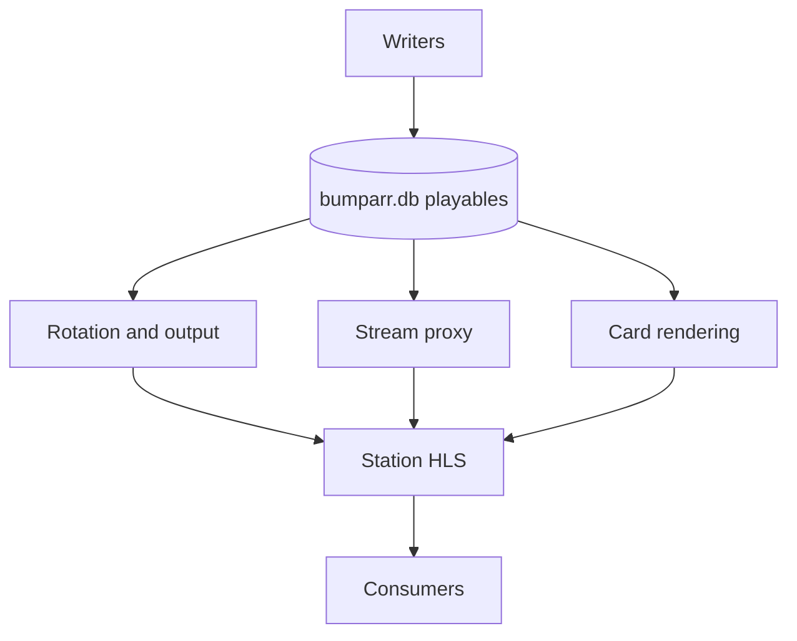

# Architecture

## Contents

- [The registry is the center of everything](#the-registry-is-the-center-of-everything)
- [Content flow](#content-flow)
- [Invariants worth preserving when changing things](#invariants-worth-preserving-when-changing-things)
- [File map](#file-map)

How Bumparr's pieces fit together. The short version: **sources land as files
or rows, production turns files into finished bumpers, one SQLite registry is
the single source of truth, one scoring model decides what plays, and a set of
background jobs keeps everything fresh.** Nothing runs in the playback path
except reading the registry.

## The registry is the center of everything

One SQLite database (`DB_PATH`) holds all state:

- `playables` — every bumper of every type (video, card, stream, image), with
  its media pointer, duration, declared weight, enabled/health flags, and
  play stats. Full reference in [SCHEMA.md](SCHEMA.md).
- `playout` / `play_history` — the channel playout cursor and play history
  (written by whatever plays the pool; read by the rotation model).

Everything else is a writer to or reader from this table. There is no second
store, no cache of content, no queue of work that survives a restart except
the fetch queue's state file.

## Content flow

```text
                 ┌────────────────────────── writers ──────────────────────────┐
                 │                                                             │
  starter seeds ─┤ ingest.py (ask-bar / "more X")   produce.py (quarry sources)│
  live_cams.yaml ├ live_cams.py (direct HLS cams)   station_ids.py (combinatorial)
  config files   ├ generators/* (cards, grounded)   seed.py (asset scan)        │
                 │ sources/capture_windows (live snapshots)                     │
                 └────────────────────────────┬────────────────────────────────┘
                                              ▼
                              bumparr.db  (playables)
                                              │
        ┌─────────────────────────────────────┼─────────────────────────────┐
        ▼                                     ▼                             ▼
  rotation.py (scoring)             stream_proxy (HLS relay)        render_cards.py
  random / fill / m3u               for non-CORS live feeds         cards: payload -> MP4
        │                                     │                             │
        └─────────────────────────────────────┬─────────────────────────────┘
                                              ▼
                         station/ (registry → HLS,
                         play history writer)
                                              │
                                              ▼
                        consumers: ErsatzTV, Tunarr,
                        Dispatcharr, players, /playlist.m3u
```



### 1. Acquisition (get material in)

- **`starter.py`** — the shipped starter seeds: queries known to return usable
  footage, run through the same ingest path.
- **`ingest.py`** — the natural-language intake. A URL, "more trivia", or a
  vibe like "5 stoner clips" routes to the right producer: live-cam insert,
  YouTube capture, archive.org/Wikimedia/Pexels/Pixabay/LoC search, or card
  generation. Every path ends in a file on disk plus a registry row.
- **`seed.py`** — scans `ASSET_ROOT` and registers any video file, so anything
  dropped in by hand or by another tool becomes a bumper on the next pass.
  Idempotent; runs on every startup.
- **`live_cams.py`** — user-configured direct-HLS cams from
  `config_files/live_cams.yaml`, upserted on startup.
- **`sources/`** — the two self-maintaining source loops: `capture_windows`
  (YouTube-backed cams snapshotted to looping MP4s) and `fetch_queue`
  (retrying archive.org downloads until they land).

### 2. Production (turn material into finished bumpers)

- **`produce.py`** — quarries source video: scene-detected, overlapping,
  length-banded windows, cut, branded with the brand slam, audio resolved by
  measurement (keep native sound, add a bed to some of the silent ones, leave
  the rest silent). Output goes to the OUTPUT tree, never back into the quarry.
- **`station_ids.py`** — combinatorial station IDs: a handful of backgrounds
  crossed with independently-rolled font roulettes.
- **`render_cards.py`** — text cards are JSON payloads until this module turns
  them into real MP4s (see [RENDERING.md](RENDERING.md)). Until then their
  `uri` is NULL and they are invisible to non-browser consumers — by design,
  Bumparr never advertises something a consumer cannot play.
- **`brandslam.py`** — the signature: a slot-machine font roulette. Each clip
  rolls its own landing face at mint time (per-clip randomness, since an MP4
  is the same bytes every play).

### 3. Cards (content with a quality pipeline)

Cards are the only content type with a real production line, because they are
generated and therefore fallible:

1. **Generation** — `generators/cards.py` (model-invented kinds),
   `generators/grounded.py` (factual kinds from real sources: Open Trivia DB,
   Wikipedia, vendored number facts), `generators/on_this_day.py` (date-bound
   cards that rotate themselves in), `generators/weather.py` (live conditions).
2. **Validation** — every candidate goes through `card_validation.py`
   (repair what's repairable, reject the rest). Factual kinds come only from
   grounded sources; the model is not used as a fact checker.
3. **Tone** — `content_filter.py` is the shared grim-content gate: kept but
   down-weighted, never with a background image.
4. **Enrichment** — `generators/enrich_bg.py` optionally attaches CC0/public-domain
   backgrounds from Openverse.
5. **Rendering** — `render_cards.py` makes them playable files; the volatile
   kinds (clock, weather) carry a TTL and re-render on a timer.

The model is optional at every step: grounded + procedural + starter-seed
content covers every kind with no model at all (CI asserts this).

### 4. Selection (what plays)

- **`rotation.py`** — the one scoring model:
  `score = base × season × daypart × recency × affinity × fatigue`. Declared vs
  computed, idempotent, nothing written back. Details and tuning in
  [ROTATION.md](ROTATION.md).
- **`seasons.py`** — calendar factors per category (holiday material ramps in
  and out rather than switching), computed at selection time, never stored.
- `/random` and any co-deployed player call the same `weights_for`, so
  probabilistic ranking means the same thing everywhere. `/fill` optimizes for
  duration; `/playlist.m3u` delegates ordering to its downstream scheduler.

### 5. Service

- **`app.py`** — FastAPI app: the API surface ([API.md](API.md)), the media
  mounts, the dashboard, and startup.
- **`jobs.py`** — in-container background loops, no host cron: window
  re-capture on `WINDOW_REFRESH_HOURS`, fetch-queue passes, volatile-card
  re-render on `VOLATILE_INTERVAL`, dated-card rotation and seasonal healing
  hourly (so midnight rollover is caught).
- **`stream_proxy.py`** — same-origin HLS relay for live feeds without CORS.

### 6. Station

`station/conform.py` pre-conforms eligible registry items into splice-safe
segments in a background sweep, outside the request path. `station/playout.py`
maintains the live and standby virtual clocks, selects conformed items, and
writes play history. `station/guide.py` turns daypart windows into the XMLTV
guide for both channels. The station routes expose the HLS playlists, segment
files, channel M3U, guide, status, and conform action.

## Invariants worth preserving when changing things

- **The registry is the only source of truth.** A file without a row does not
  play; the startup asset scan parks missing media and clears stale card URIs.
- **Idempotent refreshes, unique production.** Config/source refreshes upsert
  stable identities; intentional new renders use collision-proof identities.
- **Nothing in the playback path does heavy work.** Acquisition and production
  run as scheduled jobs or explicit actions; serving a bumper is a registry
  read plus a static file.
- **Sources and output are separate trees.** `download → cut → brand` never
  mistakes a finished bumper for raw material, and produce never quarries its
  own output or the ephemeral live-capture dir.
- **One scoring model.** If you find yourself ranking material a second way,
  it should go through `rotation.weights_for`.
- **Declared weight is never mutated by the system.** Seasonal adjustment is a
  factor applied at selection time; the historical in-place mutation has been
  healed and `base_weight` shadow values restored (see `seasons.restore_base_weights`).
- **Cards must stay playable-file or not at all.** `uri` is set by the
  renderer; nothing else should give a card a media pointer.
- **The station airs only conformed items, and conform never runs in the
  request path.**
- **Station observation is not playout.** Only HLS playlist requests extend a
  channel timeline and report started entries; status/monitoring reads are
  side-effect free.

## File map

| Path | Role |
|---|---|
| `bumparr/app.py` | FastAPI service, API, startup, dashboard mount |
| `bumparr/config.py` | every setting, one accessor, all env-documented |
| `bumparr/db.py` | schema, connection pragmas, migrations |
| `bumparr/seed.py` | asset scan → registry |
| `bumparr/ingest.py` | natural-language intake, all source adapters |
| `bumparr/starter.py` | shipped starter seeds |
| `bumparr/live_cams.py` | direct-HLS cam config → registry |
| `bumparr/produce.py` | source quarry → branded clips |
| `bumparr/station_ids.py` | combinatorial station IDs |
| `bumparr/brandslam.py` | the font-roulette brand slam |
| `bumparr/render_cards.py` | card payloads → MP4 (incl. volatile TTLs) |
| `bumparr/card_validation.py` | generation-time validation + fact re-check |
| `bumparr/content_filter.py` | shared tone (grim) policy |
| `bumparr/rotation.py` | the scoring model |
| `bumparr/seasons.py` | seasonal factors + weight healing |
| `bumparr/prune.py` | remove off-shape / orphaned material |
| `bumparr/jobs.py` | background loops (capture, queue, volatile, dated) |
| `bumparr/stream_proxy.py` | same-origin HLS relay |
| `bumparr/station/conform.py` | pre-conform registry items into splice-safe HLS segments |
| `bumparr/station/playout.py` | virtual channel clocks, selection, playlists, and play history |
| `bumparr/station/guide.py` | XMLTV guide for the live and standby channels |
| `bumparr/station/routes.py` | HLS, channel M3U, guide, status, and conform routes |
| `bumparr/generators/` | card production: model, grounded, dated, weather, bg |
| `bumparr/sources/` | self-maintaining sources: window capture, fetch queue |
| `bumparr/config_files/` | user-editable content config (cams, queue, seasons, seeds, catalog) |
| `bumparr/web/` | dashboard (vanilla JS over the API) |
| `bumparr/tools/overnight.sh` | scheduled batch: generate cards, then quarry |
